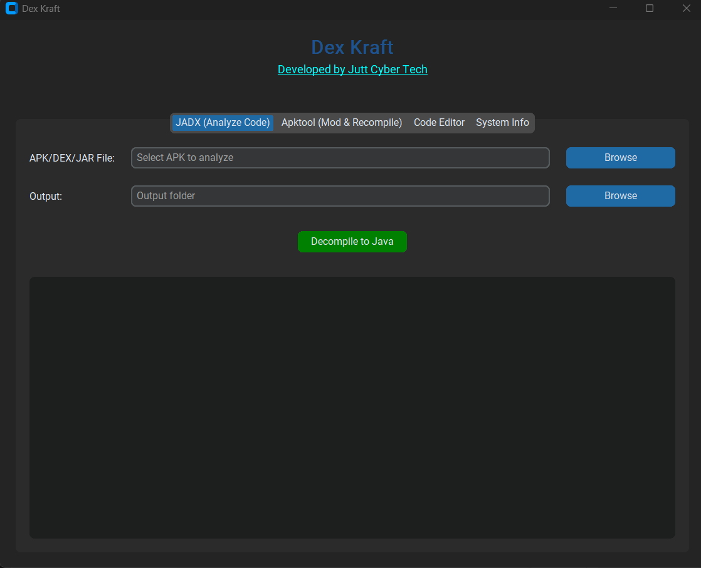

# Dex Kraft

*Developer: Jutt Cyber Tech*
[https://juttcybertech.com](https://juttcybertech.com)

# APK Decompiler Toolkit

Dex Kraft is a powerful APK decompiler app for extracting and analyzing Android APK files. Use it only with proper permission and at your own responsibility.

---

## Developer
*Jutt Cyber Tech*
[https://juttcybertech.com](https://juttcybertech.com)

---

## Supported Platforms
- **Windows** (all versions)
- **Kali Linux**
- **Other Linux distributions**

---

## Quick Start

### Clone the Repository

<a href="https://github.com/juttcybertech/DexKraft.git" target="_blank"></a>

```bash
git clone https://github.com/juttcybertech/DexKraft.git
cd DexKraft
```


### Install Requirements

#### On Windows
```bash
python -m pip install -r requirements.txt
```

#### On Kali Linux / Other Linux
```bash
pip install -r requirements.txt
```

### Run the App

#### On Windows

```bash
python DexKraft.py <path_to_apk>
```
Or use the batch files in the `jadx` and `apktool` folders for GUI and command-line decompiling.


#### On Kali Linux / Other Linux

```bash
python3 DexKraft.py <path_to_apk>
# or
python DexKraf.py <path_to_apk>
```

---

## Note
You do not need to manually download any dependencies. Dex Kraft will automatically download and set up all required dependencies for you.

## Disclaimer
This app is intended for educational, research, development, digital investigation, and malware analysis purposes only. It is a valuable tool for developers, security researchers, and investigators who need to inspect, debug, or analyze APK files. Always ensure you have proper authorization before decompiling or analyzing any APK files. You are solely responsible for your use of this tool and must comply with all applicable laws and regulations.
